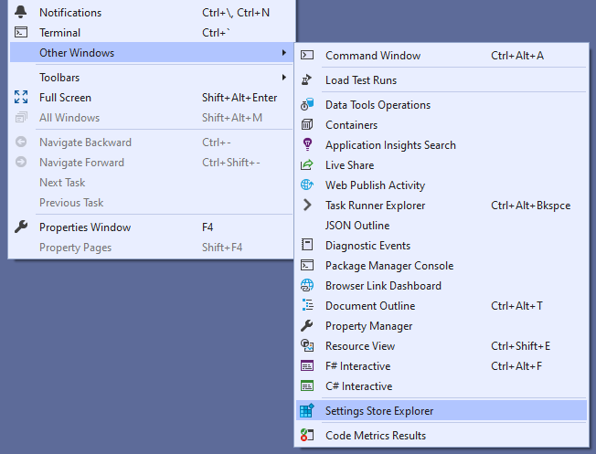
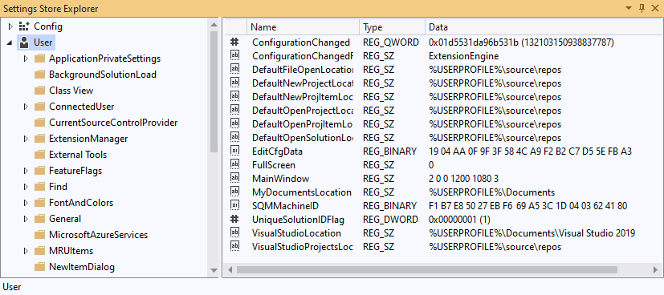

# Settings Store Explorer
A Visual Studio Extension with a tool window that allows you to view and edit the contents of Visual Studio's Settings Store.

The "Settings Store" is like the registry -- in fact, behind the scenes, it's imported and managed as a registry hive.

In earlier versions of Visual Studio, you could use Regedit to view/edit the settings store. However, that's no longer possible (since Dev14, I think) since Visual Studio supports side-by-side installation with independent settings.

## Getting Started
Download and install the extension from the Visual Studio Marketplace.

_Note: This extension collects and transmits anonymized usage statistics to the extension author for product improvement purposes._

Access the Settings Store Explorer from the View menu. It's under "View > Other Windows >Settings Store Explorer":
 

Or you can find it in "Quick search":
 

The Tool Window has two panels. The left hand panel shows four trees: Config, User, Remote and Roaming. Each tree is a hierarchical collection of sub-collections and properties. The properties for the selected sub-collection are shown in the right hand panel.
 

## Modifying (editing) settings

>  **Important:** Modifying the Settings Store is like editing the Windows Registry. You should do it only if you know what you are doing. There is no "undo" facility if you make a mistake!

If you've used the Windows Registry editor (Regedit), this should be familiar.

You can edit a property of the **User** or **Remote** trees by double-clicking it in the right-hand pane. Note that you cannot edit values or collections under the **Config** or **Roaming** trees because they are read-only.
 

A new sub-collection or values can be created by right-clicking on a collection.
 

New properties can be created in a collection by right-clicking in a blank area of the right-hand panel.

A collection or property can be renamed by pressing <kbd>F2</kbd>.

A collection or property can be deleted by pressing <kbd>Delete</kbd>.

Pressing <kbd>F5</kbd> refreshes the view.
