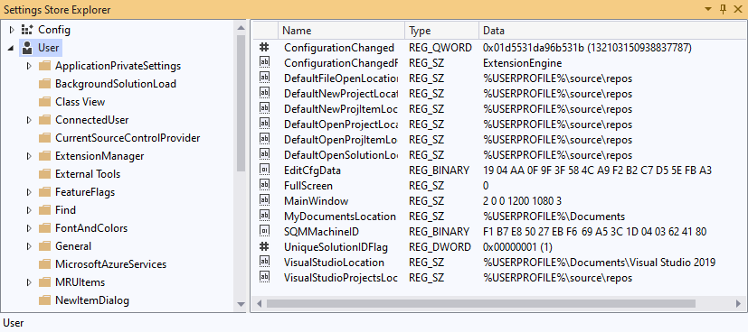
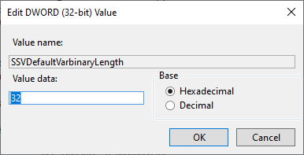
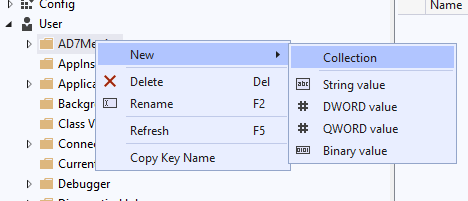

The Settings Store Explorer extension adds a tool window for viewing and editing the Visual Studio Settings Store. It's like the Windows Registry Editor, but for Visual Studio's internal settings.

## Getting Started
_Note: This extension collects and transmits anonymized usage statistics to the extension author for product improvement purposes._

Access the Settings Store Explorer from the View menu. It's under "View > Other Windows >Settings Store Explorer":
 

Or you can find it in "Quick search":
 

The Tool Window has two panels. The left hand panel shows three trees: Config, User and Remote. Each tree is a hierarchical collection of sub-collections and properties. The properties are shown in the right hand panel.
 

## Modifying (editing) settings

>  **Important:** Modifying the Settings Store is like editing the Windows Registry. You should do it only if you know what you are doing. There is no "undo" facility if you make a mistake!

If you've used the Windows Registry editor (Regedit), this should be familiar.

You can edit a property of the **User** or **Remote** trees by double-clicking it in the right-hand pane. Note that you cannot edit values or collections under the **Config** tree because they are read-only.
 

A new sub-collection or values can be created by right-clicking on a collection.
 

New properties can be created in a collection by right-clicking in a blank area of the right-hand panel.

A collection or property can be renamed by pressing <kbd>F2</kbd>.

A collection or property can be deleted by pressing <kbd>Delete</kbd>.

Pressing <kbd>F5</kbd> refreshes the view.

## Support
If you find a bug in this extension or have a feature request, please visit https://github.com/pharring/SettingsStoreView to file an issue.
