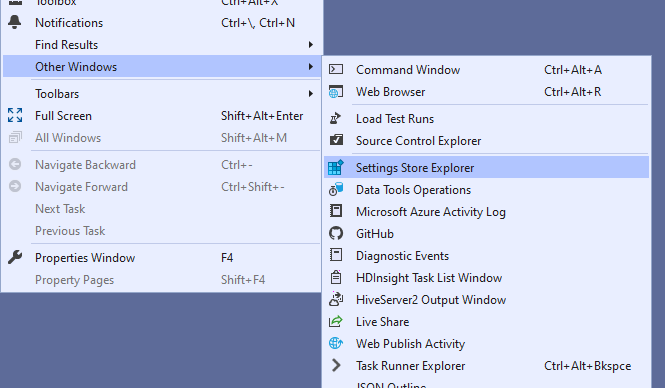
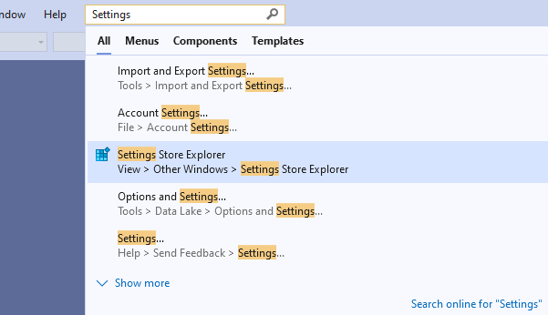

Settings Store View adds a tool window for viewing and editing the Visual Studio Settings Store. It's like the Windows Registry Editor, but for Visual Studio's internal settings.

## Getting Started
Access the Settings Store tool window from the View menu. It's under "View > Other Windows >Settings Store".

You can also find it in "Quick search".

The Tool Window has two panels. The left hand panel shows two trees: User and Config. Each tree is a hierarchical collection of sub-collections. The leaves of the tree are the properties stored within that collection and they're shown in the right hand panel.
[TODO: Screenshot of Tool Window]

You can edit a property of the "User" tree by double-clicking it in the right-hand pane.

## Support
If you find a bug in this extension or have a feature request, please visit https://github.com/pharring/SettingsStoreView to file an issue.
